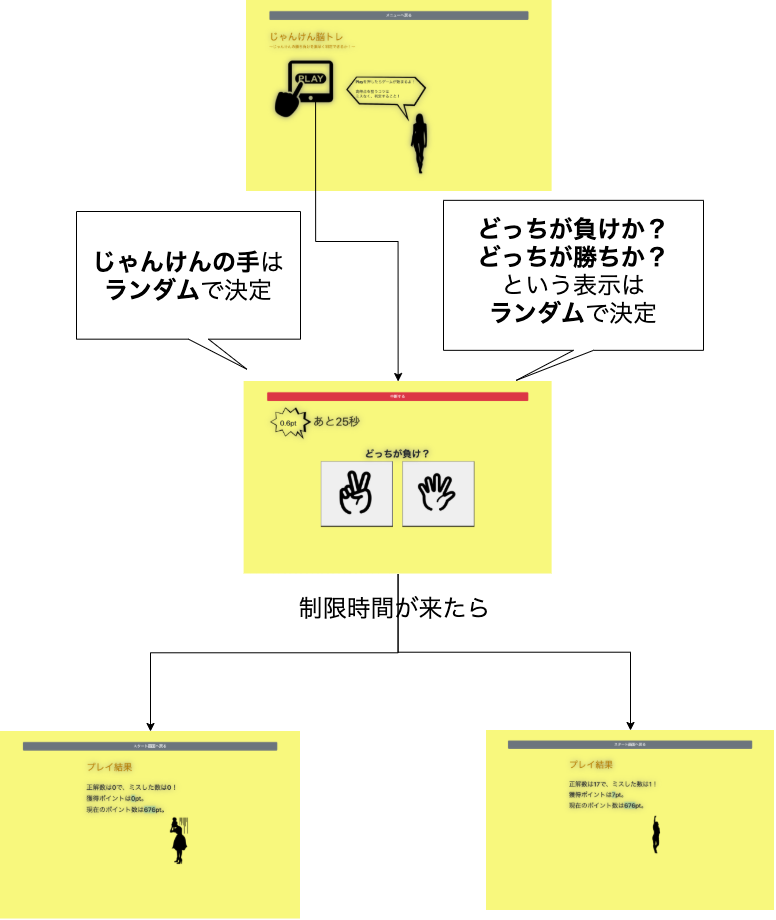
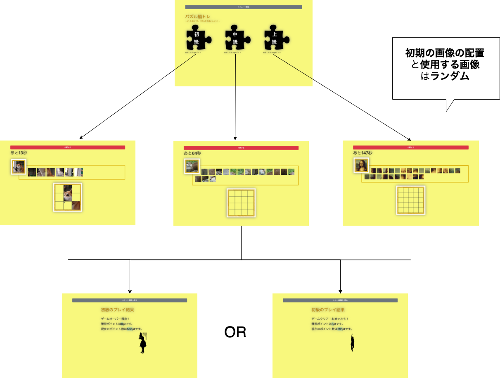

# オブジェクト指向プログラミングおよび演習 第１２回進捗レポート

## 作成者
- 学籍番号：[k]19100
- 氏名：松永一希
- グループ：３
    - k19100 松永一希
    - x19050 志村陸斗
    - k19052 篠原秀樹
    - k19109 山口　聖恩
    - k19044 桑原武志
    - k18231 森永彩葉

## 仕様
- ポイント制Webゲーム
  - 新規登録（またはログイン）をし、初期持ちポイントをうけとる。ID・パスワード入力が必要とする。
  - それぞれ、ゲームを行いポイントを集める。ゲームをやるごとに賭け金としてポイントを支払う。
  - 脳トレゲーム… 
      - じゃんけん脳トレとパズル脳トレ
      - じゃんけん脳トレ
          - 一言で言うとじゃんけんの手を素早く判定できるか?のゲーム
          - 制限時間は30秒
          - 制限時間内に正解した回数により、獲得できるポイントが決まる(最高ポイントは20pt。ただ、正解数に応じたポイント配分は未決定。実際にゲームをプレイしてから決める。)
          - 「どっちが勝ちか?」「どっちが負けか?」をランダムに表示
          - じゃんけんの手はランダムに表示
          - 途中で中断ができる
          **図1 ジャンケン脳トレの画面遷移図**
      - パズル脳トレ
          - 一言で言うと制限時間内にパズルを完成できるか?のゲーム
          - 制限時間は30秒
          - 難易度は3段階
            - ★は2×2マス
            - ★★は3×3マス
            - ★★★は4×4マス
          - 獲得できるポイント
            - パズルが未完成　→　0pt
            - ★が完成　→　1pt
            - ★★が完成 →　5pt
            - ★★★が完成 → 20pt
            - ※実際にプレイしてからポイント配分を変更する可能性あり
          - 初期の画像の配置と使用する画像はランダムに決定される
          - 途中で中断ができる
          **図1 パズル脳トレの画面遷移図**
  - ババ抜きゲーム… ３人CPUとプレイヤーで４人対戦

## 作業分担
### ホームページ(担当:志村くん）
- ログイン画面
- 新規登録画面
  - ゲーム選択画面
    - クイズゲーム画面
    - ババ抜きゲーム画面
    - 持ちポイント表示する画面  
### データ管理(担当：篠原くん・山口くん）
- Jsonファイルでニックネーム（ユーザーネーム）・ID・パスワード・ポイントを保持する
- 初期ポイントは０pts。
- ポイント
  - クイズゲームでは、最高ポイント 20ptsとする。
  - ババ抜きゲームでは、１位が２０pts,２位が10pts,３位が5pts,４位が０ptsとする。
### 脳トレゲーム(担当:森永さん）
- じゃんけん脳トレとパズル脳トレを作成する。
### ババ抜きゲーム（担当:桑原くん)
- ３人CPUとプレイヤーで４人対戦　

## 作業報告
- 

## 振り返り（感想など）
- 

